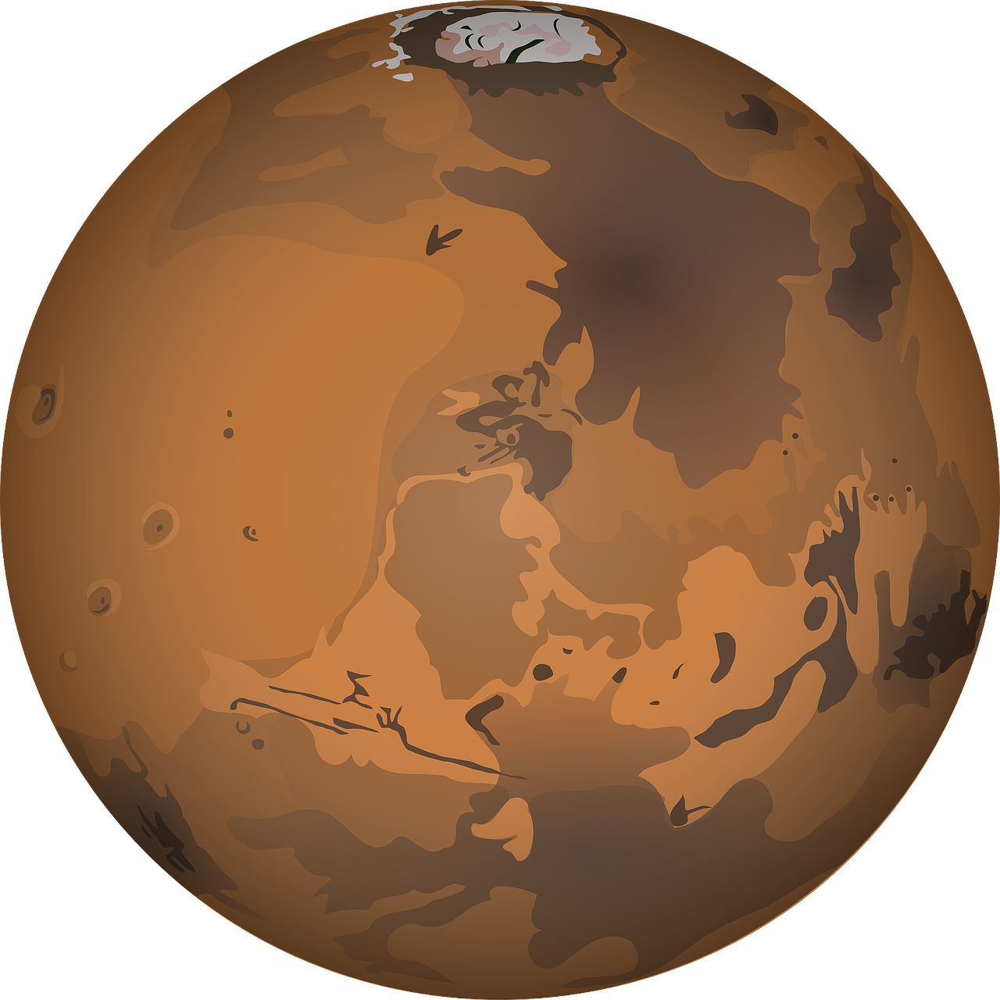

# Mars Weather App

Welcome to the Mars Weather App! This app uses Nasa's [Insight: Mars Weather Service API](https://api.nasa.gov/assets/insight/InSight%20Weather%20API%20Documentation.pdf) to show the weather from the last seven days. The live website is available [here](https://mars-daily-weather-app.netlify.app/).

## Prototype

The prototype was designed in Figma, which you can view [here](https://www.figma.com/proto/mGDdFXHJ61xavoPIeASVf0/Mars-Weather?node-id=4%3A1&viewport=232%2C410%2C1&scaling=scale-down).

## Scripts

In the project directory, you can run:

### `npm start`

This runs the app in the development mode. 
Open [http://localhost:3000](http://localhost:3000) to view it in the browser.
